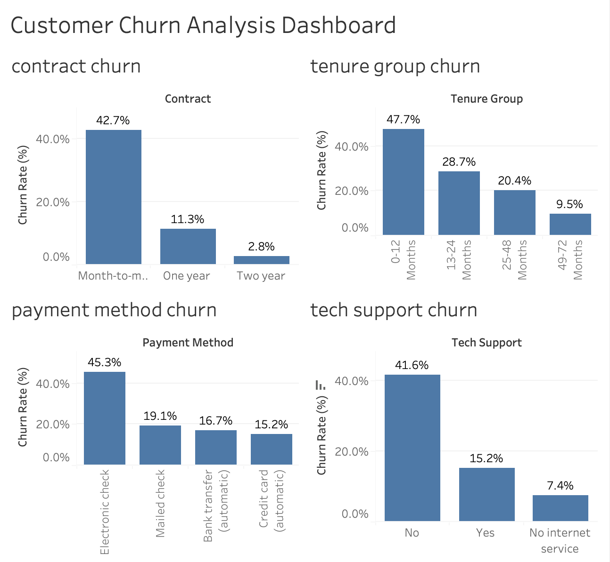

# customer-churn-analysis
Customer Churn Analysis using Python and Tableau

## Project Overview

This project analyzes customer churn behavior using the Telco Customer Churn dataset. The goal is to identify factors that contribute to customer attrition and provide business recommendations to improve customer retention.

## Tools Used

- Python
- Pandas
- NumPy
- Matplotlib
- Tableau

## Dataset

Telco Customer Churn Dataset

Total Customers: 7,043

## Data Preparation

- Removed unnecessary columns
- Converted Total Charges to numeric
- Handled missing values
- Created Churn Flag (1 = Churn, 0 = No Churn)
- Created Tenure Groups

## Key Findings

### Contract Type

- Month-to-month customers have the highest churn rate (42.7%)
- Two-year contracts have the lowest churn rate (2.8%)

### Payment Method

- Customers using Electronic Check show the highest churn rate (45.3%)

### Customer Tenure

- Customers within 0–12 months have the highest churn rate (47.7%)
- Churn decreases as customer tenure increases

### Tech Support

- Customers without tech support have a churn rate of 41.6%
- Customers with tech support churn significantly less

## Tableau Dashboard

## Business Recommendations

1. Encourage customers to move from month-to-month plans to long-term contracts.
2. Investigate why Electronic Check customers churn at higher rates.
3. Focus retention efforts on new customers during their first year.
4. Promote Tech Support services to reduce churn risk.

## Author

Gouri Sri Bolloju
